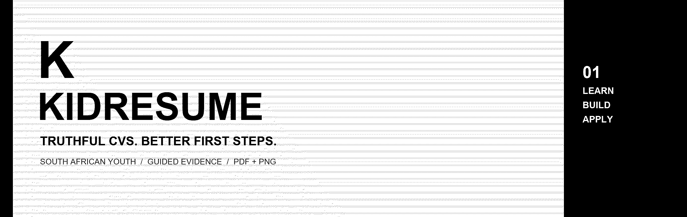
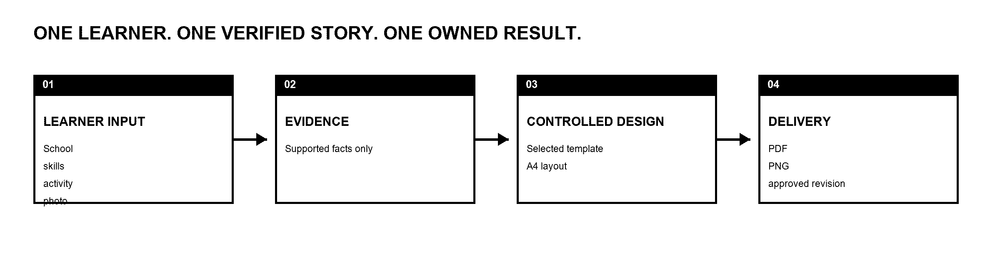
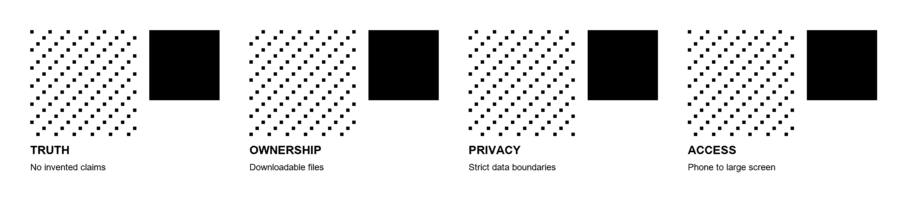

  

  <strong>Truth-first CV tools for South African youth.</strong> 
  Guided learner input → verified evidence → controlled design → useful PDF and PNG files.

> **Current status:** KidResume is an early-stage, currently unregistered and not VAT-registered venture. The service is in production engineering and controlled-pilot preparation; this page does not claim a public launch, school partnership, recruitment result, funding commitment, or employment guarantee.

## What KidResume is building

  

KidResume helps a learner describe school subjects, projects, volunteering, responsibilities and tools in a structured way. The system is designed to convert only supported facts into clear resume language, apply a controlled visual template, and deliver the same approved revision as PDF and PNG.

The product does **not** invent experience, qualifications, marks or achievements. It does **not** guarantee interviews, recruitment, placement or employment.

## Product principles

  

- **Truth before polish:** design can organise verified content; it cannot invent biography.
- **Learner ownership:** the learner receives usable PDF and PNG files.
- **Privacy by boundary:** payment, guardian, consent and provider data do not belong in the resume.
- **Accessible by default:** the customer flow is designed for phone, tablet, computer and large-screen use.
- **Human accountability:** privacy, safeguarding, design and recruitment usefulness require named human review before production release.

## Working with the organization

Production access is private. Authorized production-team members should use the member view of this organization for the repository dashboard, current activity, system maps, runbooks and release gates.

Use of the owner's personal ChatGPT subscription or any account that can create fees must be discussed with the owner and explicitly approved first. Otherwise, the production team must provision and pay for its own approved accounts. No production process may silently incur charges on a personal account.

  KidResume · South Africa · production approval outstanding

